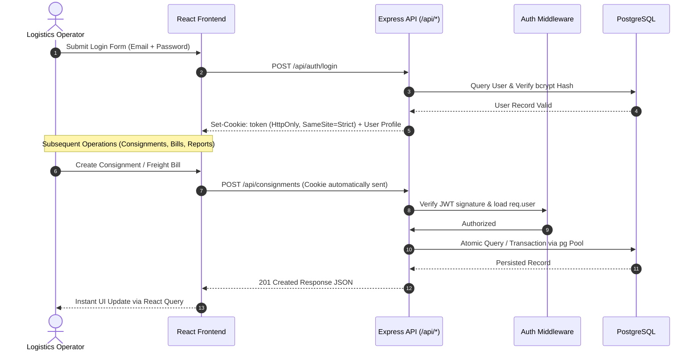

# System Architecture

The **Logistics Consignment Management System** (Matoshree Logistics) is built on a clean, decoupled 3-tier web architecture with a dedicated AI intelligence layer. The design prioritizes simplicity, high auditability, strong data consistency, and clear separation of concerns.

---

## High-Level Architecture Diagram

```mermaid
flowchart TD
    %% Global Styling
    classDef client fill:#EBF8FF,stroke:#3182CE,stroke-width:2px,color:#2B6CB0;
    classDef server fill:#EDF2F7,stroke:#4A5568,stroke-width:2px,color:#2D3748;
    classDef service fill:#FEFCBF,stroke:#D69E2E,stroke-width:2px,color:#744210;
    classDef data fill:#E6FFFA,stroke:#319795,stroke-width:2px,color:#234E52;
    classDef ai fill:#FAF5FF,stroke:#805AD5,stroke-width:2px,color:#553C9A;

    subgraph ClientTier ["1. Presentation Layer (Frontend - React + Vite)"]
        UI["React SPA<br/>(Tailwind CSS + React Router)"]:::client
        State["State & Data Fetching<br/>(TanStack React Query + Context)"]:::client
        PDF["PDF Generator<br/>(@react-pdf/renderer)"]:::client
        UI --> State
        UI --> PDF
    end

    subgraph ServerTier ["2. Backend API Layer (Express.js)"]
        Router["Express Router & Dispatcher<br/>(/api/*)"]:::server
        Auth["Security & Middlewares<br/>(JWT Cookie Auth + CORS + Errors)"]:::server
        Controllers["Route Controllers<br/>(Auth, Customers, Trips, Consignments, Bills)"]:::server
        
        Router --> Auth
        Auth --> Controllers
    end

    subgraph LogicTier ["3. Business Logic & Adapters"]
        BizLogic["Services & Generators<br/>(LR Number, Bill Number, Calculations)"]:::service
        ORM["PostgreSQL Adapter<br/>(Custom Mongoose-compatible PgModel)"]:::service
        
        Controllers --> BizLogic
        Controllers --> ORM
        BizLogic --> ORM
    end

    subgraph DataTier ["4. Persistent Storage (PostgreSQL)"]
        DB[("PostgreSQL Database<br/>(7 Relational Tables + Ledger)")]:::data
        ORM -->|pg Connection Pool| DB
    end

    subgraph AITier ["5. AI Billing Intelligence (LangGraph StateGraph)"]
        AgentNode["Agent Node<br/>(ChatGoogleGenerativeAI: gemini-3.6-flash)"]:::ai
        ToolCondition{"toolsCondition<br/>(Conditional Edge)"}:::ai
        ToolNode["ToolNode<br/>(Zod Schemas + billingTools)"]:::ai
        
        Controllers -.->|Invoke Graph| AgentNode
        AgentNode --> ToolCondition
        ToolCondition -->|has tool_calls| ToolNode
        ToolNode -->|ToolMessages Loop| AgentNode
        ToolCondition -->|no tool_calls| EndNode([END Response]):::ai
        ToolNode -->|Direct Query| DB
    end

    %% Client to Server connection
    State -->|HTTP / REST + JSON<br/>(Credentials: Include)| Router
```

---

## Architectural Layers

### 1. Presentation Layer (Frontend)
- **Framework**: React 19 single-page application bundled with Vite 5.
- **Styling**: Tailwind CSS 3.4 for a responsive, modern interface.
- **State & Caching**: TanStack React Query (`@tanstack/react-query`) handles server-state caching, automatic cache invalidation, and refetching.
- **Client Routing**: React Router v6 with protected routes.
- **Reporting & Export**: Client-side document generation using `@react-pdf/renderer` and spreadsheet exports using `xlsx`.
- **Charts & Visualizations**: Recharts for monthly consignment and trip trend visualizers.

### 2. API Gateway & Routing (Backend)
- **Runtime**: Node.js (>= 18) with Express.js.
- **Routing Structure**: Modular routes mapped under `/api`:
  - `/api/auth`: Session issuance and termination.
  - `/api/customers`: Consigners and consignees master registry.
  - `/api/trips`: Vehicle movement and dispatch records.
  - `/api/consignments`: Lorry receipts (LR) lifecycle.
  - `/api/freight-bills`: Invoicing, tax calculations, and payment tracking.
  - `/api/reports`: Aggregation reports for management.
  - `/api/dashboard`: Real-time KPI counters and recent records.
  - `/api/search`: Global search indexing.
  - `/api/admin`: Payment settlement ledgers and AI assistance.

### 3. Business Logic & Adapter Layer
- **Auto-Generators**: Unique sequential identifiers generated for Lorry Receipts (`LR-YYYYMMDD-XXXX`), Customer Codes (`CUST-XXXX`), and Freight Bills (`FB-YYYYMM-XXXX`).
- **PostgreSQL Abstraction (`pgModel.js`)**: An in-house lightweight query adapter that provides intuitive query semantics (`find`, `countDocuments`, `populate`, `findById`, `save`, `deleteOne`) directly on top of native PostgreSQL via parameter-safe connection pooling.
- **Financial Audit Snapshotting**: Customer details (name, GST, address, phone) are snapshotted directly onto freight bills at creation time to preserve historical billing integrity.

### 4. Database Layer (PostgreSQL)
- **Driver**: Native `pg` connection pool (`Pool` from `pg`).
- **Data Model**: Relational structure with foreign key checks (`RESTRICT` on consignments and customer/trip links, `CASCADE` on freight bill lines and payment entries).
- **Payment Ledger**: Multi-payment tracking supporting partial settlements, remaining balance math, and automated bill status updates (`Unpaid` -> `Partially Paid` -> `Paid`).

### 5. AI Intelligence Layer (LangGraph & Google Gemini)
- **Framework & SDK**: `@langchain/langgraph`, `@langchain/google-genai`, `@langchain/core`, and `zod` with model `gemini-3.6-flash`.
- **Orchestration Model**: Cyclical StateGraph (`StateGraph(MessagesAnnotation)`):
  - **Agent Node**: Injects `SYSTEM_PROMPT` and invokes `ChatGoogleGenerativeAI` bound with billing tools.
  - **Conditional Edges**: Uses `toolsCondition` to dynamically route between the `tools` node and `END`.
  - **Tool Node**: `ToolNode` auto-executes database query tools (`get_billing_summary`, `get_unpaid_bills`, `get_partially_paid_bills`, `get_paid_bills`) and loops back to the agent node until final response synthesis is complete.
  - **Guardrails**: Hard iteration cap via `{ recursionLimit: 10 }` to avoid infinite tool loops, preventing data hallucination.

---

## Security & Data Flow



---

## Key Design Decisions

| Decision | Implementation | Why It Matters |
|:---|:---|:---|
| **Cookie-Based JWT** | `HttpOnly`, `SameSite=Strict` cookie | Protects against XSS attacks stealing authentication tokens. |
| **Customer Snapshotting** | Snapshot columns on `freight_bills` | Guarantees bills remain historically valid and legal even if customer address or GST changes later. |
| **Parameterized Queries** | Native `$1, $2` parameters via `pg` | Prevents SQL injection across all dynamic search and filter endpoints. |
| **Atomic Payment Ledger** | `freight_bill_payments` table + running balance | Prevents balance drift and provides a complete audit trail of every partial or full payment. |
| **Deterministic AI Tools** | Gemini Function Calling to SQL Service | Ensures the AI assistant only outputs verified financial numbers from the database. |
