# Database Architecture & Schema Specification

The **Logistics Consignment Management System** uses **PostgreSQL** as its core relational datastore. The schema enforces referential integrity, historical financial immutability, and transactional payment reconciliation.

---

## Entity Relationship Diagram (ERD)

```mermaid
erDiagram
    users {
        int id PK
        string name
        string email UK
        string password
        string role
        timestamp created_at
        timestamp updated_at
    }

    customers {
        int id PK
        string customer_code UK
        string company_name
        string contact_person
        string gst_number
        string pan_number
        string phone
        string email
        text address
        string city
        string state
        string pincode
        string country
        text remarks
        timestamp created_at
        timestamp updated_at
    }

    trips {
        int id PK
        string trip_number UK
        string vehicle_number
        string source
        string destination
        timestamp departure_date
        timestamp expected_arrival
        string status
        text remarks
        timestamp created_at
        timestamp updated_at
    }

    consignments {
        int id PK
        string lr_number UK
        timestamp booking_date
        string booking_time
        int consigner_id FK
        int consignee_id FK
        int trip_id FK
        string invoice_number
        timestamp invoice_date
        string eway_bill_number
        timestamp eway_bill_date
        timestamp eway_bill_valid_upto
        text description
        string package_type
        int package_count
        numeric actual_weight
        numeric chargeable_weight
        numeric goods_value
        numeric freight
        numeric collection_charges
        numeric door_delivery_charges
        numeric hamali
        numeric st_charges
        numeric other_charges
        numeric insurance
        numeric total_amount
        string status
        string bill_status
        string payment_status
        int freight_bill_id FK
        timestamp created_at
        timestamp updated_at
    }

    freight_bills {
        int id PK
        string bill_number UK
        timestamp bill_date
        string mode
        int customer_id FK
        string company_name
        string gst_number
        string phone
        text address
        string city
        string state
        string pincode
        timestamp from_date
        timestamp to_date
        numeric rate_per_kg
        numeric taxable_amount
        numeric cgst_rate
        numeric sgst_rate
        numeric igst_rate
        numeric cgst_amount
        numeric sgst_amount
        numeric igst_amount
        numeric grand_total
        string amount_in_words
        string status
        numeric paid_amount
        int created_by FK
        timestamp created_at
        timestamp updated_at
    }

    freight_bill_lines {
        int id PK
        int freight_bill_id FK
        int consignment_id FK
        int sr_no
        string lr_number
        timestamp lr_date
        string source
        string destination
        string invoice_number
        timestamp invoice_date
        numeric weight
        numeric freight
        numeric collection_charges
        numeric door_delivery_charges
        numeric lr_charges
        numeric other_charges
        numeric amount
    }

    freight_bill_payments {
        int id PK
        int freight_bill_id FK
        numeric amount
        timestamp payment_date
        string mode
        text notes
        int created_by FK
        timestamp created_at
    }

    customers ||--o{ consignments : "consigns"
    customers ||--o{ consignments : "receives"
    customers ||--o{ freight_bills : "invoiced_to"
    trips ||--o{ consignments : "carries"
    freight_bills ||--o{ freight_bill_lines : "itemizes"
    freight_bills ||--o{ freight_bill_payments : "settled_by"
    consignments ||--o| freight_bill_lines : "referenced_in"
    freight_bills ||--o{ consignments : "links"
    users ||--o{ freight_bills : "creates"
    users ||--o{ freight_bill_payments : "logs"
```



---

## Table Specifications

### 1. `users`
Stores user accounts for administrative and operational staff.

| Column | Type | Constraints | Description |
|:---|:---|:---|:---|
| `id` | `SERIAL` | `PRIMARY KEY` | Auto-incrementing identifier |
| `name` | `VARCHAR(150)` | Nullable | Full name of the user |
| `email` | `VARCHAR(255)` | Unique (case-insensitive) | Login email address |
| `password` | `TEXT` | Not Null | Bcrypt salted & hashed password |
| `role` | `VARCHAR(50)` | Default `'admin'` | Role permissions (`admin`, `staff`) |
| `created_at` | `TIMESTAMP` | `DEFAULT NOW()` | Record creation timestamp |
| `updated_at` | `TIMESTAMP` | `DEFAULT NOW()` | Record last update timestamp |

**Indexes**:
- `UNIQUE INDEX idx_users_email_unique ON users (LOWER(email))`

---

### 2. `customers`
Master directory of business clients acting as consigners or consignees.

| Column | Type | Constraints | Description |
|:---|:---|:---|:---|
| `id` | `SERIAL` | `PRIMARY KEY` | Auto-incrementing identifier |
| `customer_code` | `VARCHAR(50)` | `UNIQUE` | Unique business identifier (e.g. `CUST-0001`) |
| `company_name` | `VARCHAR(255)` | Not Null | Registered company / trade name |
| `contact_person` | `VARCHAR(255)` | Nullable | Primary contact representative |
| `gst_number` | `VARCHAR(50)` | Nullable | 15-character GST identification |
| `pan_number` | `VARCHAR(50)` | Nullable | Permanent Account Number |
| `phone` | `VARCHAR(50)` | Not Null | Primary phone / mobile number |
| `email` | `VARCHAR(255)` | Nullable | Contact email address |
| `address` | `TEXT` | Nullable | Street / industrial area address |
| `city` | `VARCHAR(100)` | Nullable | City / Hub |
| `state` | `VARCHAR(100)` | Nullable | State jurisdiction |
| `pincode` | `VARCHAR(20)` | Nullable | Postal ZIP code |
| `country` | `VARCHAR(100)` | Default `'India'` | Country |
| `remarks` | `TEXT` | Nullable | Operational notes |
| `created_at` | `TIMESTAMP` | `DEFAULT NOW()` | Timestamp |
| `updated_at` | `TIMESTAMP` | `DEFAULT NOW()` | Timestamp |

**Indexes**:
- `UNIQUE INDEX idx_customers_customer_code_unique ON customers (customer_code)`
- `INDEX idx_customers_company_name ON customers (company_name)`
- `INDEX idx_customers_phone ON customers (phone)`
- `INDEX idx_customers_gst_number ON customers (gst_number)`

---

### 3. `trips`
Tracks dispatch vehicles, routes, and transit progress.

| Column | Type | Constraints | Description |
|:---|:---|:---|:---|
| `id` | `SERIAL` | `PRIMARY KEY` | Auto-incrementing identifier |
| `trip_number` | `VARCHAR(50)` | `UNIQUE` | Unique trip identifier (e.g. `TRIP-0001`) |
| `vehicle_number` | `VARCHAR(100)` | Not Null | Commercial vehicle license plate |
| `source` | `VARCHAR(255)` | Not Null | Starting warehouse / origin city |
| `destination` | `VARCHAR(255)` | Not Null | Terminal warehouse / destination city |
| `departure_date` | `TIMESTAMP` | Nullable | Scheduled or actual departure |
| `expected_arrival` | `TIMESTAMP` | Nullable | Estimated time of arrival |
| `status` | `VARCHAR(50)` | Check constraint | `'To Be Gone'`, `'Ongoing'`, `'Completed'` |
| `remarks` | `TEXT` | Nullable | Trip log remarks |
| `created_at` | `TIMESTAMP` | `DEFAULT NOW()` | Timestamp |
| `updated_at` | `TIMESTAMP` | `DEFAULT NOW()` | Timestamp |

**Indexes**:
- `UNIQUE INDEX idx_trips_trip_number_unique ON trips (trip_number)`
- `INDEX idx_trips_vehicle_number ON trips (vehicle_number)`
- `INDEX idx_trips_status ON trips (status)`
- `INDEX idx_trips_departure_date ON trips (departure_date)`

---

### 4. `consignments`
The core transactional entity representing a Lorry Receipt (LR) consignment note.

| Column | Type | Constraints | Description |
|:---|:---|:---|:---|
| `id` | `SERIAL` | `PRIMARY KEY` | Auto-incrementing identifier |
| `lr_number` | `VARCHAR(100)` | `UNIQUE` | Unique LR Number (e.g. `LR-20260916-0001`) |
| `booking_date` | `TIMESTAMP` | Not Null | Booking date |
| `booking_time` | `VARCHAR(50)` | Not Null | Booking time string |
| `consigner_id` | `INTEGER` | `FK -> customers(id) ON DELETE RESTRICT` | Dispatching customer |
| `consignee_id` | `INTEGER` | `FK -> customers(id) ON DELETE RESTRICT` | Receiving customer |
| `trip_id` | `INTEGER` | `FK -> trips(id) ON DELETE RESTRICT` | Assigned transport trip |
| `invoice_number` | `VARCHAR(100)` | Nullable | Commercial invoice number |
| `invoice_date` | `TIMESTAMP` | Nullable | Commercial invoice date |
| `eway_bill_number`| `VARCHAR(100)` | Nullable | Government e-Way bill number |
| `eway_bill_date` | `TIMESTAMP` | Nullable | e-Way bill generation date |
| `eway_bill_valid_upto` | `TIMESTAMP` | Nullable | e-Way bill expiry date |
| `description` | `TEXT` | Nullable | Cargo description |
| `package_type` | `VARCHAR(100)` | Nullable | Packaging form (Box, Pallet, Drum) |
| `package_count` | `INTEGER` | Default 1 | Total number of packages |
| `actual_weight` | `NUMERIC(12,3)`| Default 0.000 | Measured scale weight in KG |
| `chargeable_weight` | `NUMERIC(12,3)`| Default 0.000 | Volumetric/billed weight in KG |
| `goods_value` | `NUMERIC(14,2)`| Default 0.00 | Declared cargo value in INR |
| `freight` | `NUMERIC(14,2)`| Default 0.00 | Base freight charge |
| `collection_charges`| `NUMERIC(14,2)`| Default 0.00 | Pickup charges |
| `door_delivery_charges`| `NUMERIC(14,2)`| Default 0.00 | Last-mile delivery charges |
| `hamali` | `NUMERIC(14,2)`| Default 0.00 | Handling / labor charges |
| `st_charges` | `NUMERIC(14,2)`| Default 0.00 | Stationary / documentation charges |
| `other_charges` | `NUMERIC(14,2)`| Default 0.00 | Ancillary fee |
| `insurance` | `NUMERIC(14,2)`| Default 0.00 | Goods transit insurance |
| `total_amount` | `NUMERIC(14,2)`| Default 0.00 | Total calculated consignment cost |
| `status` | `VARCHAR(50)` | Default `'Pending'` | Delivery status (`Pending`, `In Transit`, `Delivered`) |
| `bill_status` | `VARCHAR(50)` | Default `'Not Billed'` | Billing status (`Not Billed`, `Bill Generated`) |
| `payment_status` | `VARCHAR(50)` | Default `'Pending'` | Payment status (`Pending`, `Paid`) |
| `freight_bill_id`| `INTEGER` | `FK -> freight_bills(id) ON DELETE SET NULL` | Parent freight bill when billed |

**Indexes**:
- `UNIQUE INDEX idx_consignments_lr_number_unique ON consignments (lr_number)`
- `INDEX idx_consignments_consigner_id ON consignments (consigner_id)`
- `INDEX idx_consignments_consignee_id ON consignments (consignee_id)`
- `INDEX idx_consignments_trip_id ON consignments (trip_id)`
- `INDEX idx_consignments_freight_bill_id ON consignments (freight_bill_id)`
- `INDEX idx_consignments_booking_date ON consignments (booking_date)`
- `INDEX idx_consignments_bill_status ON consignments (bill_status)`
- `INDEX idx_consignments_payment_status ON consignments (payment_status)`
- `INDEX idx_consignments_invoice_number ON consignments (invoice_number)`
- `INDEX idx_consignments_eway_bill_number ON consignments (eway_bill_number)`

---

### 5. `freight_bills`
Consolidated commercial freight tax invoice issued to a client.

| Column | Type | Constraints | Description |
|:---|:---|:---|:---|
| `id` | `SERIAL` | `PRIMARY KEY` | Auto-incrementing identifier |
| `bill_number` | `VARCHAR(100)` | `UNIQUE` | Unique invoice number (e.g. `FB-202609-0001`) |
| `bill_date` | `TIMESTAMP` | Default `NOW()` | Date of billing |
| `mode` | `VARCHAR(50)` | Default `'Road'` | Transit mode |
| `customer_id` | `INTEGER` | `FK -> customers(id) ON DELETE RESTRICT` | Invoiced client |
| `company_name` | `VARCHAR(255)` | Snapshot | Customer company name at bill creation |
| `address` | `TEXT` | Snapshot | Customer address at bill creation |
| `city` | `VARCHAR(100)` | Snapshot | Customer city at bill creation |
| `state` | `VARCHAR(100)` | Snapshot | Customer state at bill creation |
| `pincode` | `VARCHAR(20)` | Snapshot | Customer pincode at bill creation |
| `gst_number` | `VARCHAR(50)` | Snapshot | Customer GSTIN at bill creation |
| `phone` | `VARCHAR(50)` | Snapshot | Customer phone at bill creation |
| `from_date` | `TIMESTAMP` | Not Null | Billing cycle start date |
| `to_date` | `TIMESTAMP` | Not Null | Billing cycle end date |
| `rate_per_kg` | `NUMERIC(14,2)`| Not Null | Agreed contract rate per kg |
| `taxable_amount`| `NUMERIC(14,2)`| Default 0.00 | Total base freight + surcharge amount |
| `cgst_rate` | `NUMERIC(8,3)` | Default 0.000 | Central GST percentage (e.g. 9.00) |
| `sgst_rate` | `NUMERIC(8,3)` | Default 0.000 | State GST percentage (e.g. 9.00) |
| `igst_rate` | `NUMERIC(8,3)` | Default 0.000 | Integrated GST percentage |
| `cgst_amount` | `NUMERIC(14,2)`| Default 0.00 | Central GST calculated amount |
| `sgst_amount` | `NUMERIC(14,2)`| Default 0.00 | State GST calculated amount |
| `igst_amount` | `NUMERIC(14,2)`| Default 0.00 | Integrated GST calculated amount |
| `grand_total` | `NUMERIC(14,2)`| Not Null | Final invoice payable amount |
| `amount_in_words`| `TEXT` | Not Null | Grand total rendered in formal words |
| `status` | `VARCHAR(50)` | Check constraint | `'Unpaid'`, `'Partially Paid'`, `'Paid'` |
| `paid_amount` | `NUMERIC(14,2)`| Default 0.00 | Cumulative payments received |
| `created_by` | `INTEGER` | `FK -> users(id) ON DELETE SET NULL` | Generating user ID |
| `created_at` | `TIMESTAMP` | `DEFAULT NOW()` | Timestamp |
| `updated_at` | `TIMESTAMP` | `DEFAULT NOW()` | Timestamp |

**Indexes**:
- `UNIQUE INDEX freight_bills_bill_number_unique ON freight_bills (bill_number)`
- `INDEX idx_freight_bills_customer_id ON freight_bills (customer_id)`
- `INDEX idx_freight_bills_bill_date ON freight_bills (bill_date)`
- `INDEX idx_freight_bills_status ON freight_bills (status)`
- `INDEX idx_freight_bills_company_name ON freight_bills (company_name)`

---

### 6. `freight_bill_lines`
Individual itemized LR consignment entries attached to a freight bill.

| Column | Type | Constraints | Description |
|:---|:---|:---|:---|
| `id` | `SERIAL` | `PRIMARY KEY` | Auto-incrementing identifier |
| `freight_bill_id` | `INTEGER` | `FK -> freight_bills(id) ON DELETE CASCADE` | Parent bill |
| `consignment_id` | `INTEGER` | `FK -> consignments(id) ON DELETE RESTRICT` | Referenced LR |
| `sr_no` | `INTEGER` | Line sequence number |
| `lr_number` | `VARCHAR(100)` | LR identifier |
| `lr_date` | `TIMESTAMP` | Booking date |
| `source` | `VARCHAR(255)` | Origin hub |
| `destination` | `VARCHAR(255)` | Destination hub |
| `invoice_number` | `VARCHAR(100)` | Consignment commercial invoice |
| `invoice_date` | `TIMESTAMP` | Consignment commercial invoice date |
| `weight` | `NUMERIC(12,3)`| Billed weight in KG |
| `freight` | `NUMERIC(14,2)`| Computed freight (`weight * rate_per_kg`) |
| `collection_charges`| `NUMERIC(14,2)`| Pickup charges |
| `door_delivery_charges`| `NUMERIC(14,2)`| Delivery charges |
| `lr_charges` | `NUMERIC(14,2)`| Stationary / LR charges |
| `other_charges` | `NUMERIC(14,2)`| Other charges (Hamali + Insurance) |
| `amount` | `NUMERIC(14,2)`| Total item line charge |

**Constraints & Indexes**:
- `UNIQUE (freight_bill_id, consignment_id)`
- `INDEX idx_freight_bill_lines_bill_id ON freight_bill_lines (freight_bill_id)`
- `INDEX idx_freight_bill_lines_consignment_id ON freight_bill_lines (consignment_id)`

---

### 7. `freight_bill_payments`
Audit log recording every payment installment received against a bill.

| Column | Type | Constraints | Description |
|:---|:---|:---|:---|
| `id` | `SERIAL` | `PRIMARY KEY` | Auto-incrementing identifier |
| `freight_bill_id` | `INTEGER` | `FK -> freight_bills(id) ON DELETE CASCADE` | Associated freight bill |
| `amount` | `NUMERIC(14,2)`| Not Null (`CHECK (amount > 0)`) | Installment received in INR |
| `payment_date` | `TIMESTAMP` | `DEFAULT NOW()` | Date and time payment received |
| `mode` | `VARCHAR(50)` | Nullable | Payment mode (NEFT, RTGS, Cheque, Cash) |
| `notes` | `TEXT` | Nullable | Transaction reference / UTR number |
| `created_by` | `INTEGER` | `FK -> users(id) ON DELETE SET NULL` | Operator logging the transaction |
| `created_at` | `TIMESTAMP` | `DEFAULT NOW()` | Record creation timestamp |

**Indexes**:
- `INDEX idx_freight_bill_payments_bill_id ON freight_bill_payments (freight_bill_id)`
- `INDEX idx_freight_bill_payments_payment_date ON freight_bill_payments (payment_date)`

---

## Referential Integrity & Deletion Rules

| Parent Table | Child Table | Foreign Key Column | On Delete Action | Rationale |
|:---|:---|:---|:---|:---|
| `customers` | `consignments` | `consigner_id`, `consignee_id` | `RESTRICT` | Prevent deletion of customers with dispatch/receipt history. |
| `trips` | `consignments` | `trip_id` | `RESTRICT` | Prevent deletion of trips containing consignments. |
| `freight_bills`| `consignments` | `freight_bill_id` | `SET NULL` | Dissolving a bill releases consignments back to unbilled state. |
| `freight_bills`| `freight_bill_lines` | `freight_bill_id` | `CASCADE` | Deleting a bill cleans up its line items. |
| `freight_bills`| `freight_bill_payments`| `freight_bill_id` | `CASCADE` | Payments belong strictly to the parent bill. |
| `users` | `freight_bills` | `created_by` | `SET NULL` | Deleting a staff account preserves financial invoice history. |

---

## Sequence Self-Healing Logic

To guarantee that sequential ID counters do not collide when seeds or bulk migrations are executed, the following PostgreSQL sequence synchronization script is executed during migration:

```sql
SELECT setval(
    pg_get_serial_sequence('consignments', 'id'),
    COALESCE((SELECT MAX(id) FROM consignments), 1),
    (SELECT COUNT(*) > 0 FROM consignments)
);
```
*(Repeated for `users`, `customers`, `trips`, `freight_bills`, `freight_bill_lines`, and `freight_bill_payments`)*.
